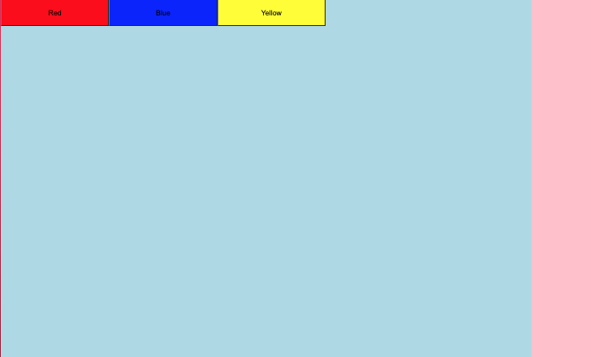

# PedroTech-ReactJSStyledComponentsFull-20210317

> Pedro Tech - Styled Components Full Tutorial - Style Your Components in React (Mar 17, 2021)

Link: https://www.youtube.com/watch?v=-FZzPHSLauc

**Description**
> ReactJS Styled Components tutorial! In this video I will go over everything you need to know about the library! Styled-Components is a css library in react which allow you to style components very easily!

🚀 Learn ReactJS By Building 6 Projects: https://codedamn.com/learn/reactjs-pr...

---


### Table of Contents
- [PedroTech-ReactJSStyledComponentsFull-20210317](#pedrotech-reactjsstyledcomponentsfull-20210317)
    - [Table of Contents](#table-of-contents)
- [1 - Project Setup](#1---project-setup)
  - [Create Project](#create-project)
  - [src structure:](#src-structure)
  - [VS Code Extensions](#vs-code-extensions)
  - [Install Styled Components](#install-styled-components)
- [2 - Basic Usage Demonstration](#2---basic-usage-demonstration)
- [3 - Multiple styled components from the same file](#3---multiple-styled-components-from-the-same-file)
- [4 - Passing props in Styled Components](#4---passing-props-in-styled-components)
- [5 - Hover, Active, Focus](#5---hover-active-focus)
- [6 - Nesting styles and ones state affecting by another's interaction](#6---nesting-styles-and-ones-state-affecting-by-anothers-interaction)
- [7 - Using Custom Elements in Styled components](#7---using-custom-elements-in-styled-components)
- [8 - GlobalStyles.style.js](#8---globalstylesstylejs)
- [Getting Started with Create React App](#getting-started-with-create-react-app)
  - [Available Scripts](#available-scripts)
    - [`yarn start`](#yarn-start)
    - [`yarn test`](#yarn-test)
    - [`yarn build`](#yarn-build)
    - [`yarn eject`](#yarn-eject)
  - [Learn More](#learn-more)
    - [Code Splitting](#code-splitting)
    - [Analyzing the Bundle Size](#analyzing-the-bundle-size)
    - [Making a Progressive Web App](#making-a-progressive-web-app)
    - [Advanced Configuration](#advanced-configuration)
    - [Deployment](#deployment)
    - [`yarn build` fails to minify](#yarn-build-fails-to-minify)

---
# 1 - Project Setup

## Create Project

```jsx
npx create-react-app pedrotech-reactjsstyledcomponentsfull-20210317

cd npx create-react-app pedrotech-reactjsstyledcomponentsfull-20210317

yarn start
```

## src structure:

- App.js
- index.js
- reportWebVitals.js

## VS Code Extensions

vscode-styled-componentsj - Julien Poissonnier

[vscode-styled-components - Visual Studio Marketplace](https://marketplace.visualstudio.com/items?itemName=jpoissonnier.vscode-styled-components)

## Install Styled Components

```jsx
yarn add styled-components
```

---

# 2 - Basic Usage Demonstration

create new components/Button.style.js

```jsx
import styled from 'styled-components'

export const Button = styled.button`
  width:200px;
  height:50px;
  background-color:red;
`
```

App.js

```jsx
import React from 'react'
import { Button } from './components/Button.style'

const App = () => {
  return (
    <div>
      <Button>Click</Button>
      <Button>Click</Button>
      <Button>Click</Button>
    </div>
  )
}

export default App
```

# 3 - Multiple styled components from the same file

Button.style.js

```jsx
import styled from 'styled-components'

export const RedButton = styled.button`
  width:200px;
  height:50px;
  background-color:red;
`

export const BlueButton = styled.button`
  width:200px;
  height:50px;
  background-color:blue;
`

export const GreenButton = styled.button`
  width:200px;
  height:50px;
  background-color:green;
`
```

App.js

```jsx
import React from 'react'
import { RedButton, BlueButton, GreenButton } from './components/Button.style'

const App = () => {
  return (
    <div>
      <RedButton>Click</RedButton>
      <BlueButton>Click</BlueButton>
      <GreenButton>Click</GreenButton>

    </div>
  )
}

export default App
```

but then seen here ^^ they are just basically the same button but different colors which is inefficient

# 4 - Passing props in Styled Components

components/Button.style.js

```jsx
import styled from 'styled-components'

export const Button = styled.button`
  width:200px;
  height:50px;
  background-color:${props => props.backgroundColor};
`
```

App.tsx

```jsx
import React from 'react'
import { Button } from './components/Button.style'

const App = () => {
  return (
    <div>
      <Button backgroundColor="red">Click</Button>
      <Button backgroundColor="blue">Click</Button>
      <Button backgroundColor="yellow">Click</Button>

    </div>
  )
}

export default App
```

# 5 - Hover, Active, Focus

components/Button.style.js

```jsx
export const Button = styled.button`
  width:200px;
  height:50px;
  background-color:${props => props.backgroundColor};

  &:hover{
    background-color:coral;
  }

  &:active{
    background-color: pink;
  }
`
```

# 6 - Nesting styles and ones state affecting by another's interaction

components/Button.style.js

```jsx
import styled from 'styled-components'

export const Button = styled.button`
  width:200px;
  height:50px;
  background-color:${props => props.backgroundColor};

	/*  similar to .Button:hover label{} */
  &:hover{
    background-color:coral;
    & label{
      color:green;
    }
  }

  &:active{
    background-color: pink;
  }
`

export const ButtonLabel = styled.label`
  font-size:25px;
  color:white;
`
```

# 7 - Using Custom Elements in Styled components

create new components/Button.js:

```jsx
import React from 'react'

const Button = ({ className, buttonLabel }) => {
  return <button className={className}><label>{buttonLabel}</label></button>
}

export default Button
```

Button.style.js

```jsx
import styled from 'styled-components'
import Button from './Button'

export const StyledButton = styled(Button)`
  width:200px;
  height:50px;
  background-color:${props => props.backgroundColor};

	/*  similar to .Button:hover label{} */
  &:hover{
    background-color:coral;
    & label{
      color:green;
    }
  }

  &:active{
    background-color: pink;
  }
`

export const ButtonLabel = styled.label`
  font-size:25px;
  color:white;
`
```

import the component then observe the export statement of StyleButton

App.js

```jsx
import React from 'react'
import { StyledButton } from './components/Button.style'
import { AppContainer } from './components/Container.style'

const App = () => {
  return (
    <AppContainer>
      <StyledButton backgroundColor="red" buttonLabel="Red" />
      <StyledButton backgroundColor="blue" buttonLabel="Blue" />
      <StyledButton backgroundColor="yellow" buttonLabel="Yellow" />

    </AppContainer>
  )
}

export default App
```

# 8 - GlobalStyles.style.js

create new src/GlobalStyles.style.js

```jsx
import { createGlobalStyle } from 'styled-components'

export const GlobalStyles = createGlobalStyle`
  body{
    background-color:pink;
    margin:0px;
    padding:0px
  }
`
```

app.js

```jsx
import React from 'react'
import { StyledButton } from './components/Button.style'
import { AppContainer } from './components/Container.style'
import { GlobalStyles } from './GlobalStyles.style'

const App = () => {
  return (
    <AppContainer>
      <GlobalStyles />
      <StyledButton backgroundColor="red" buttonLabel="Red" />
      <StyledButton backgroundColor="blue" buttonLabel="Blue" />
      <StyledButton backgroundColor="yellow" buttonLabel="Yellow" />

    </AppContainer>
  )
}

export default App
```

---
# Getting Started with Create React App

This project was bootstrapped with [Create React App](https://github.com/facebook/create-react-app).

## Available Scripts

In the project directory, you can run:

### `yarn start`

Runs the app in the development mode.\
Open [http://localhost:3000](http://localhost:3000) to view it in the browser.

The page will reload if you make edits.\
You will also see any lint errors in the console.

### `yarn test`

Launches the test runner in the interactive watch mode.\
See the section about [running tests](https://facebook.github.io/create-react-app/docs/running-tests) for more information.

### `yarn build`

Builds the app for production to the `build` folder.\
It correctly bundles React in production mode and optimizes the build for the best performance.

The build is minified and the filenames include the hashes.\
Your app is ready to be deployed!

See the section about [deployment](https://facebook.github.io/create-react-app/docs/deployment) for more information.

### `yarn eject`

**Note: this is a one-way operation. Once you `eject`, you can’t go back!**

If you aren’t satisfied with the build tool and configuration choices, you can `eject` at any time. This command will remove the single build dependency from your project.

Instead, it will copy all the configuration files and the transitive dependencies (webpack, Babel, ESLint, etc) right into your project so you have full control over them. All of the commands except `eject` will still work, but they will point to the copied scripts so you can tweak them. At this point you’re on your own.

You don’t have to ever use `eject`. The curated feature set is suitable for small and middle deployments, and you shouldn’t feel obligated to use this feature. However we understand that this tool wouldn’t be useful if you couldn’t customize it when you are ready for it.

## Learn More

You can learn more in the [Create React App documentation](https://facebook.github.io/create-react-app/docs/getting-started).

To learn React, check out the [React documentation](https://reactjs.org/).

### Code Splitting

This section has moved here: [https://facebook.github.io/create-react-app/docs/code-splitting](https://facebook.github.io/create-react-app/docs/code-splitting)

### Analyzing the Bundle Size

This section has moved here: [https://facebook.github.io/create-react-app/docs/analyzing-the-bundle-size](https://facebook.github.io/create-react-app/docs/analyzing-the-bundle-size)

### Making a Progressive Web App

This section has moved here: [https://facebook.github.io/create-react-app/docs/making-a-progressive-web-app](https://facebook.github.io/create-react-app/docs/making-a-progressive-web-app)

### Advanced Configuration

This section has moved here: [https://facebook.github.io/create-react-app/docs/advanced-configuration](https://facebook.github.io/create-react-app/docs/advanced-configuration)

### Deployment

This section has moved here: [https://facebook.github.io/create-react-app/docs/deployment](https://facebook.github.io/create-react-app/docs/deployment)

### `yarn build` fails to minify

This section has moved here: [https://facebook.github.io/create-react-app/docs/troubleshooting#npm-run-build-fails-to-minify](https://facebook.github.io/create-react-app/docs/troubleshooting#npm-run-build-fails-to-minify)
